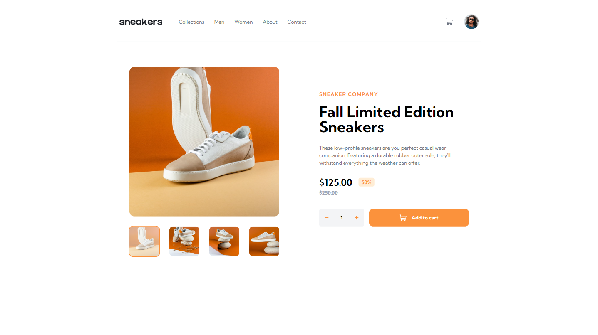
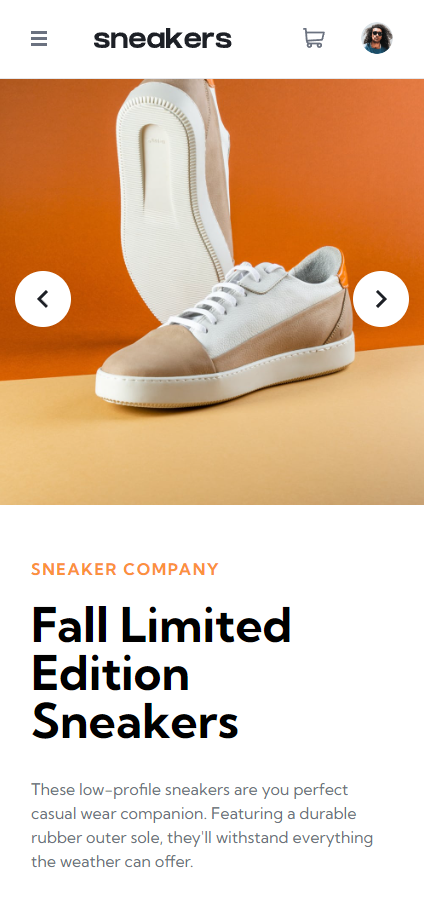
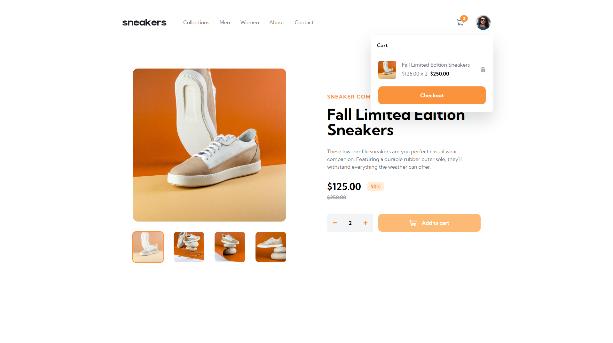
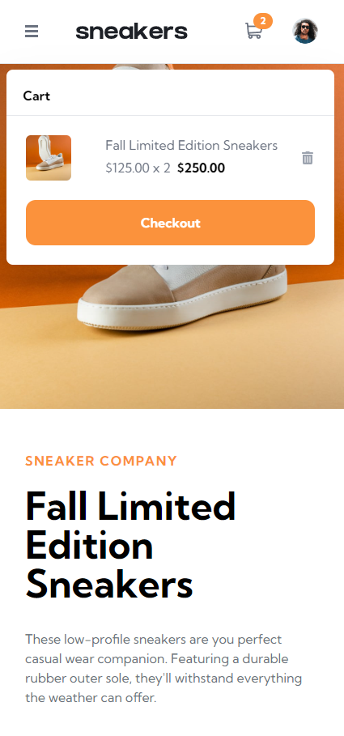
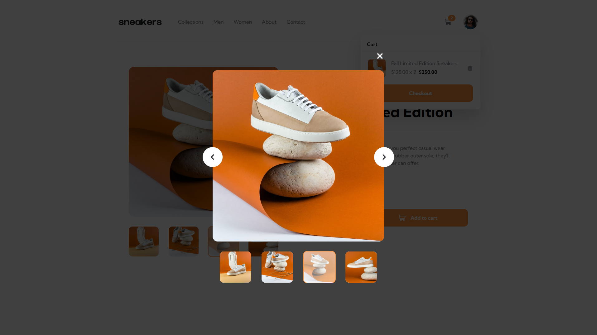

# E-Commerce Product Page | Frontend Mentor

This is a solution to the
[E-commerce product page challenge on Frontend Mentor](https://www.frontendmentor.io/challenges/ecommerce-product-page-UPsZ9MJp6).

## Table of contents

-   [Overview](#overview)
    -   [The challenge](#the-challenge)
    -   [Screenshot](#screenshot)
    -   [Links](#links)
-   [My process](#my-process)
    -   [Built with](#built-with)
    -   [Useful resources](#useful-resources)
-   [Author](#author)

## Overview

### The challenge

Your users should be able to:

-   Open a lightbox gallery by clicking on the large product image
-   Switch the large product image by clicking on the small thumbnail images
-   Add items to the cart
-   View the cart and remove items from it
-   View the optimal layout for the site depending on their device's screen size
-   See hover states for all interactive elements on the page

### Screenshot

| Desktop                                | Mobile                                   |
| -------------------------------------- | ---------------------------------------- |
| Design                                 |                                          |
|          |             |
| Checkout                               |                                          |
|  |     |
| Modal                                  | Product Text Mobile                      |
|     |  |

### Links

-   [Live Site](https://product-page.danik.dev/)
-   [Solution](https://github.com/DaniKOrdo/frontendmentor/tree/main/E-Commerce-Product-Page)

## My process

### Built with

-   [React](https://react.dev/) - JS library
-   [Vite](https://vitejs.dev/) - For Development & Project Bundling
-   [TailwindCSS](https://tailwindcss.com/) - For Styles

### Useful resources

-   [react.dev](https://react.dev/reference/react/useContext) - Use Context

## Author

-   [danik.dev](https://danik.dev/)
-   Frontend Mentor -
    [@DaniKOrdo](https://www.frontendmentor.io/profile/DaniKOrdo)
-   GitHub - [@DaniKOrdo](https://github.com/DaniKOrdo)